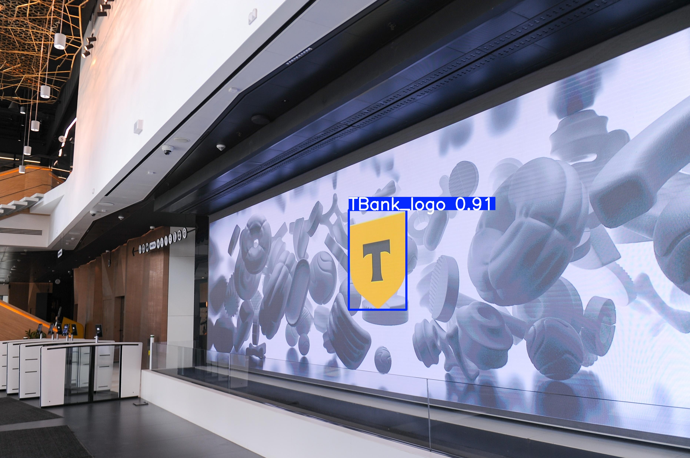
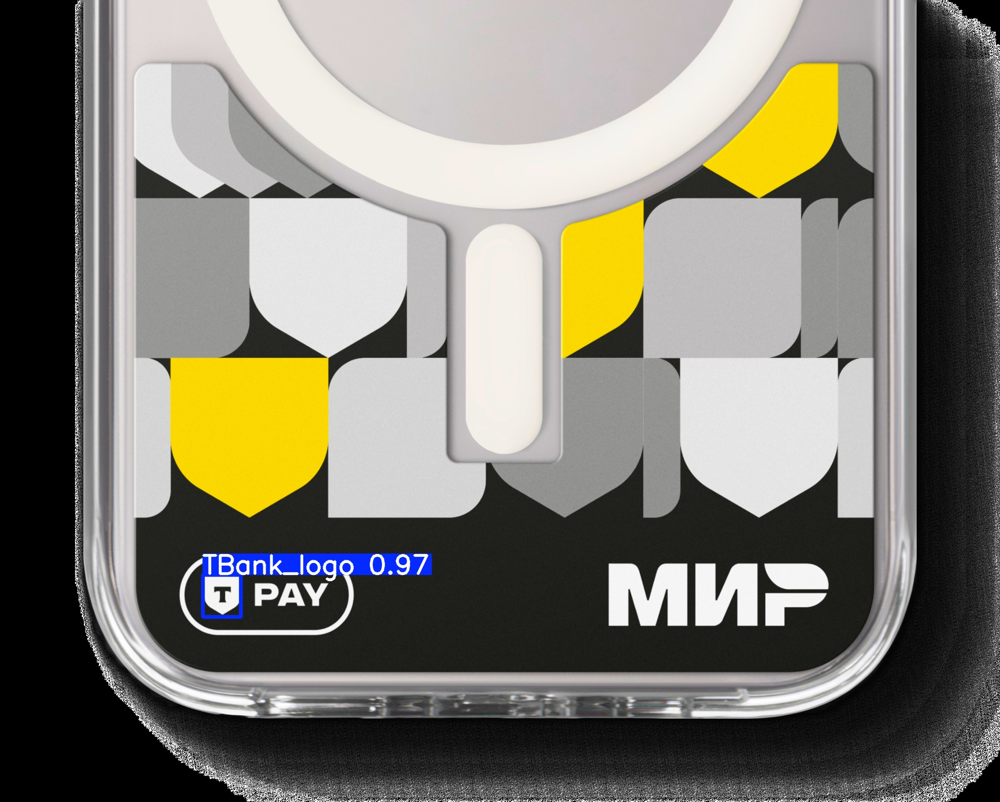

## T-Bank Logo Detection API

REST API сервис для детекции логотипа Т-Банка на изображениях. Сервис использует обученную модель YOLO и возвращает координаты найденных логотипов.

   

### Содержание
- [Возможности](#возможности)
- [Быстрый старт](#быстрый-старт)
- [Запуск локально](#запуск-локально)
- [Docker](#docker)
- [Переменные окружения](#конфигурация-переменные-окружения)
- [Валидация качества](#валидация-качества)
- [Подход к решению](#подход-к-решению)
- [Работа с данными](#работа-с-данными)
- [Результаты](#результаты)
- [Ложные срабатывания (False Positives)](#ложные-срабатывания-false-positives)
- [Где вставить иллюстрации](#где-вставить-иллюстрации)
- [FAQ / Troubleshooting](#faq--troubleshooting)
- [Публикация весов и валидационного набора](#публикация-весов-и-валидационного-набора)
- [Ссылки](#ссылки)
- [Автор](#автор)

### Возможности
- Эндпоинт `POST /detect` принимает изображение и возвращает список `bbox` по спецификации Pydantic
- Поддерживаемые форматы: JPEG, PNG, BMP, WEBP
- Время обработки: ориентировано < 10 сек/изображение на CPU, быстрее на GPU
- Эндпоинт `GET /health` для проверки работоспособности
  - Возвращает устройство, путь к весам и основные параметры инференса
  - Лимит размера файла и таймаут (по умолчанию 10MB и 10s) настраиваются через env

### Быстрый старт
```bash
# Docker (скачать веса по ссылке Яндекс.Диска)
docker build -t tbank-logo-api .
docker run --rm -p 8000:8000 -e WEIGHTS_URL="https://disk.yandex.ru/d/rZ0bPhrG0MZuFQ" tbank-logo-api

# Проверка
curl http://localhost:8000/health
curl -X POST http://localhost:8000/detect -F "file=@demo.jpg"
```

### API контракт (Pydantic)
```python
class BoundingBox(BaseModel):
    x_min: int
    y_min: int
    x_max: int
    y_max: int

class Detection(BaseModel):
    bbox: BoundingBox

class DetectionResponse(BaseModel):
    detections: List[Detection]
```

Пример запроса:
```bash
curl -X POST "http://localhost:8000/detect" \
  -H "Content-Type: multipart/form-data" \
  -F "file=@demo.jpg"
```

### Запуск локально
1. Установить зависимости:
```bash
pip install -r requirements.txt
```
2. Настройка весов модели:
- По умолчанию путь внутри проекта: `weights/best.pt`
- Рекомендуется автоскачивание по публичной ссылке (Яндекс.Диск):
```bash
set WEIGHTS_URL=https://disk.yandex.ru/d/rZ0bPhrG0MZuFQ
```
- Либо укажите локальный путь к весам:
```bash
set WEIGHTS_PATH=D:\\weights\\best.pt
```
3. Запустить сервис:
```bash
uvicorn app.main:app --host 0.0.0.0 --port 8000
```

### Docker
Сборка образа:
```bash
docker build -t tbank-logo-api .
```
Запуск (с локальными весами, проброс порта 8000):
```bash
docker run --rm -p 8000:8000 -e WEIGHTS_PATH=/weights/best.pt -v D:\\weights:/weights tbank-logo-api
```
Либо скачать веса по URL при старте (пример с Яндекс.Диском):
```bash
docker run --rm -p 8000:8000 -e WEIGHTS_URL="https://disk.yandex.ru/d/rZ0bPhrG0MZuFQ" tbank-logo-api
```

### Конфигурация (переменные окружения)
| Переменная | Значение по умолчанию | Назначение |
|---|---|---|
| `WEIGHTS_PATH` | `weights/best.pt` | Локальный путь к весам модели |
| `WEIGHTS_URL` | — | Публичная ссылка (поддерживается Яндекс.Диск) для автоскачивания весов |
| `CONF_THRESHOLD` | `0.25` | Порог уверенности детекции |
| `IOU_THRESHOLD` | `0.45` | Порог NMS по IoU |
| `IMG_SIZE` | `640` | Размер входа инференса |
| `DEVICE` | `auto` | `cpu` / `cuda` / `auto` |
| `MAX_FILE_SIZE_MB` | `10` | Лимит размера загружаемого файла |
| `REQUEST_TIMEOUT_S` | `10` | Таймаут обработки запроса |
| `MAX_IMAGE_PIXELS` | `25_000_000` | Лимит пикселей у изображения |
| `MAX_CONCURRENCY` | `4` | Лимит параллельных запросов |
| `WARMUP` | `0` | Прогрев модели при старте (`1` — включить) |
| `LOG_LEVEL` | `INFO` | Уровень логирования |

### Валидация качества
Скрипт `validate.py` считает Precision/Recall/F1 при IoU=0.5 на предоставленных разметках (формат YOLO):
```bash
python validate.py --images_dir dataset/val/images --labels_dir dataset/val/labels --iou 0.5 --output validation_metrics.json
```
Визуализация предсказаний для отчёта:
```bash
python scripts/visualize_predictions.py --images dataset/test/images --out out/viz --max 50
```

Загрузка тестового набора с Яндекс.Диска (пример):
```bash
# скачиваем test/images
python scripts/download_yadisk_public.py --public-link "https://disk.yandex.ru/d/8wH2owJfcRL6Gg" --remote-path "test/images" --dest dataset/test/images
# скачиваем test/labels
python scripts/download_yadisk_public.py --public-link "https://disk.yandex.ru/d/8wH2owJfcRL6Gg" --remote-path "test/labels" --dest dataset/test/labels
```
Вывод:
```json
{
  "images": 302,
  "tp": 123,
  "fp": 7,
  "fn": 9,
  "precision": 0.946,
  "recall": 0.932,
  "f1": 0.939,
  "iou_threshold": 0.5
}
```

### Подход к решению
После первичного обзора датасета стало видно, что большинство логотипов ориентированы фронтально (без сильных наклонов и перспективных искажений). Это позволило начать с простого и практичного baseline без сложных архитектур.

- Выбор модели: YOLO (Ultralytics) — из‑за простоты пайплайна, скорости обучения и хорошей скорости инференса.
- Дубликаты: в исходных данных встречаются многочисленные дубликаты. Это двояко: дубликаты слегка «нагоняют» объём данных, но создают риск переобучения и завышенных метрик (если одинаковые кадры попадают и в train, и в val). В промышленной настройке дубликаты лучше убирать (perceptual hash/SSIM) или грамотно контролировать при сплите.
- Альтернативы: DETR/RT‑DETR, YOLOv9/v10, связка GroundingDINO + SAM (zero‑shot), CLIP‑guided proposals, синтетическое размещение логотипов (augmentation), self‑training/pseudo‑labeling. Однако для ограниченного времени и ресурса YOLO дала максимальную отдачу.
- Модель обучалась на RTX 2080 — не топовая, зато обогрев топовый.

### Работа с данными
- Этап 1: разметка ~100 изображений в LabelImg (только логотип Т‑банка). Обучение базовой модели и прогон по всему датасету. Модель выделила ≈3700 изображений с логотипом и ≈26300 без.
  - По ручной проверке: ~80% верных детекций; остальное — FP/FN. Ошибки: необычные цвета, малое представительство наклонов, ненадёжные случаи с очень низким качеством.
  - Частые ложные срабатывания: Роснефть, ТЕЛЕ2, Райффайзен (похожая геометрия/контраст). После дообучения большинство таких срабатываний исчезло; размытую Роснефть детектор иногда всё ещё ловит, но с низкой уверенностью (<0.7).
- Этап 2: расширение обучающей выборки до ~3000 изображений и корректный сплит на train/val (например, 80/20; фиксированный seed; исключение пересечений одинаковых кадров между сплитами). Остальные ~26000 оставлены для повторной валидации на «чистом» множестве.
- Этап 3: дополнение внешними сценами (банкоматы, наружная реклама) ~300 изображений. Это улучшило устойчивость к реальным сценариям; на банкоматах средняя уверенность держалась ≈0.85.

### Результаты
- На собственной валидации (IoU=0.5) метрики в рабочем диапазоне; визуально модель уверенно ловит фронтальные логотипы, слабее — на больших наклонах и редких цветовых вариациях.
- Для отчёта отрисовка детекций формируется скриптом визуализации (см. выше), результаты можно приложить как примеры.
- Запас для улучшений: добавить примеры сильных наклонов/перспективы, контрастных условий освещения, редких цветовых схем; расширить негативные примеры схожих логотипов.

### Ложные срабатывания (False Positives)
Ниже — характерные примеры ложных детекций, которые встречались на ранних итерациях модели. Причины — геометрическое сходство (контрастные чёрно‑жёлтые формы, крупная однотонная заливка, прямоугольные полосы/буквы), а также недостаток «hard negative» примеров на этапе обучения.

<p float="left">
  
  
  
  
</p>

- Примеры путаницы: логотипы Райффайзен, ТЕЛЕ2, абстрактные чёрно‑жёлтые символы, крупные пиктограммы (например, Excel‑иконка на однотонном фоне). На некоторых кадрах модель рисовала большой бокс по контрастным границам.
- После дообучения с целевыми «hard negative» образцами (добавлены подборки Роснефть/ТЕЛЕ2/Райффайзен и пр.) количество FP существенно снизилось. В редких случаях сильно размытая «Роснефть» всё ещё детектируется с низкой уверенностью (< 0.7), что легко отсекается порогом `conf`.

Как снижались FP:
- Добавлены «hard negative» примеры похожих логотипов и абстрактной графики.
- Тюнинг порога `conf` и `iou` (баланс precision/recall под требования кейса).
- Аугментации: цвет/гамма/blur/перспектива, чтобы уменьшить зависимость от цвета и фронтальности.
- Пересмотр сплита/дубликатов, чтобы похожие кадры не «просачивались» одновременно в train и val.

Что ещё можно сделать:
- Ещё расширить набор негативных примеров (особенно жёлто‑чёрные композиции). Добавлять «обманки» намеренно.
- Ввести лёгкую двухстадийную проверку: быстрый YOLO + маленький re‑ranker (например, шаблон/фичи) для кандидатов с пограничным score.
- Ограничить минимальный/максимальный аспект‑ratio боксов или фильтровать по площади, если это согласовано с бизнес‑требованиями.

### Где вставить иллюстрации
- Вставьте 6–12 примеров из `out/viz` (по 2–3 на кейс: фронтальные, наклон, «ложные друзья» вроде Роснефти/ТЕЛЕ2/Райффайзен, ночные/низкоконтрастные).
- Графики precision/recall/F1 можно построить поверх `validation_metrics.json` (по нескольким порогам conf) и разместить рядом.

### Галерея результатов
<p float="left">
  
  
  
  
  
  
  
  
</p>

### FAQ / Troubleshooting
- Docker Desktop не стартует / EOF при сборке:
  - Полный перезапуск Docker Desktop, `wsl --shutdown`, включить WSL2 и Linux containers.
  - Очистить кэш билдера: `docker system prune -af` и `docker builder prune -af`.
  - Сборка без BuildKit: `setx DOCKER_BUILDKIT 0` и `docker build --no-cache ...`.
- Плохая скорость первого запроса: включите прогрев `WARMUP=1`.
- Слишком большие изображения: повысить `MAX_IMAGE_PIXELS` или уменьшить размер входного файла.

### Публикация весов и валидационного набора
- Веса `best.pt` (Яндекс.Диск): https://disk.yandex.ru/d/rZ0bPhrG0MZuFQ
- Тестовый набор (папка `test/images`, `test/labels` на Яндекс.Диск): https://disk.yandex.ru/d/8wH2owJfcRL6Gg
  - Если защита капчей мешает автоскачиванию в контейнере, скачайте вручную и используйте `WEIGHTS_PATH`.

### Ссылки
- Репозиторий GitHub: https://github.com/piledreke/tbank-logo-detector


